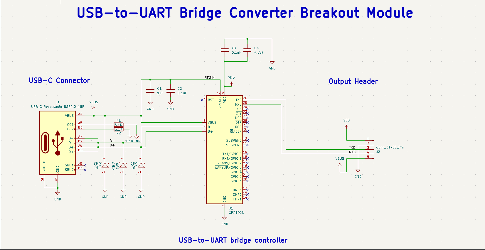
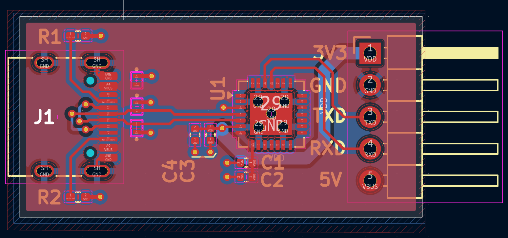
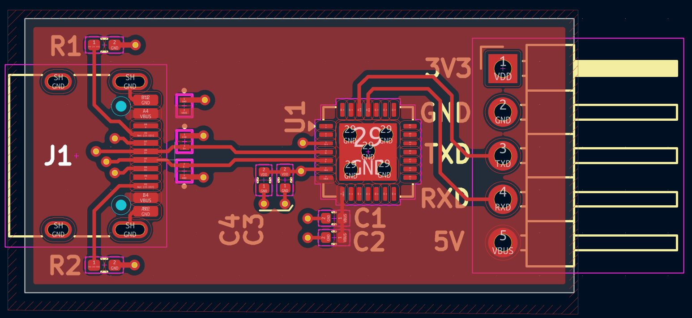
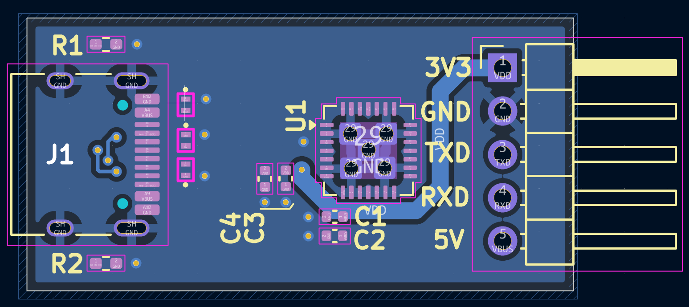
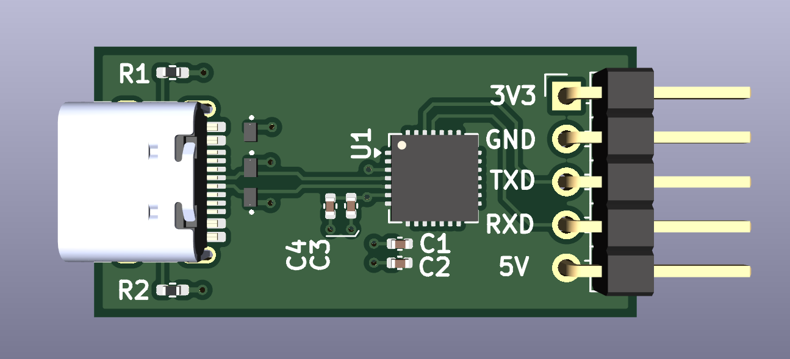
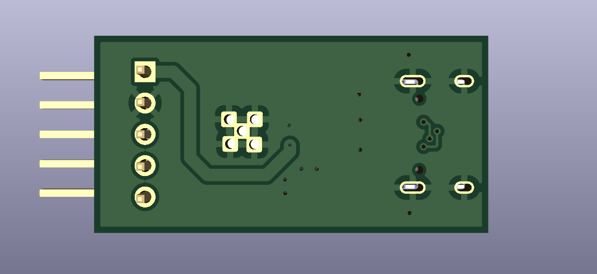

# CP2102N USB-C to UART Bridge Module

## Description
A 32x16mm, two-layer USB-to-UART bridge converter based on the Silicon Labs CP2102N. This board provides a serial interface for hardware development and debugging.

The design includes specific additions to address reliability issues common in similar modules, specifically the addition of TVS diodes for ESD protection and proper CC pin termination for USB-C standard compliance.

## Specifications
*   **Controller:** Silicon Labs CP2102N
*   **Connector:** USB Type-C
*   **Logic Level:** 3.3V (with 5V VBUS passthrough)
*   **Dimensions:** 32mm x 16mm
*   **PCB Layers:** 2
*   **EDA Tool:** KiCad

## Hardware Features
*   **ESD Protection:** uClamp3601P TVS diodes on the VBUS, D+, and D- lines, placed at the connector to clamp transient voltages.
*   **USB-C Termination:** Independent 5.1k Ohm pull-down resistors (R1, R2) on the CC1 and CC2 pins for host detection with C-to-C cables.
*   **Layout:** Continuous bottom ground plane for return paths. Decoupling capacitors (C1-C4) are routed near the IC power pins.
*   **Pinout:** 3V3, GND, TXD, RXD, and 5V broken out to a standard 2.54mm pitch header.

## Board Images

### Schematic

### PCB Layout (Revised)

### 3D Render (Top)

### 3D Render (Bottom)

## Assembly Notes
The CP2102N utilizes a QFN-28 package with an exposed center pad. Solder paste and a reflow profile or hot plate are required for correct termination of the ground pad. The TVS diodes and passives are standard surface mount components.

## Author
Harsha
